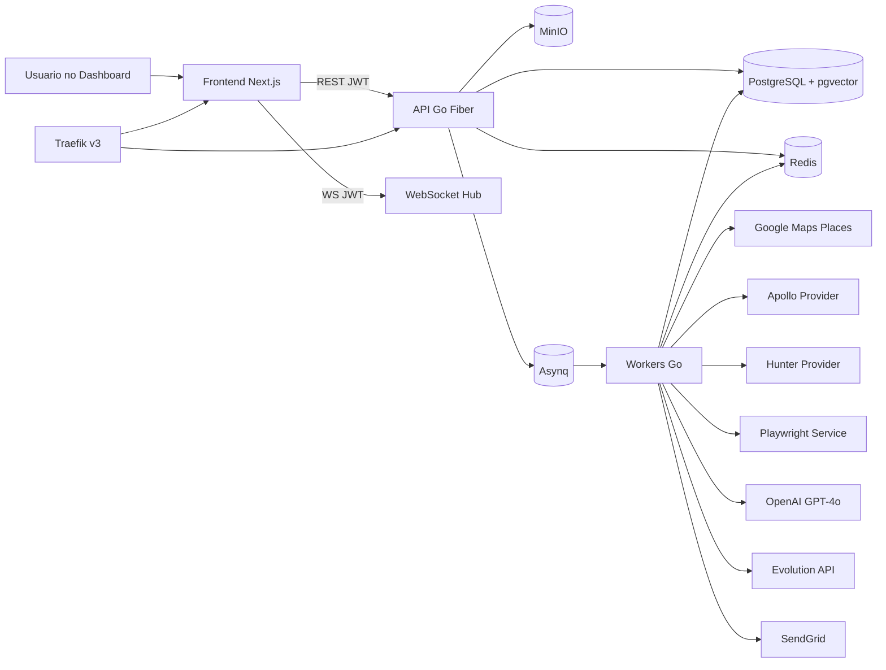
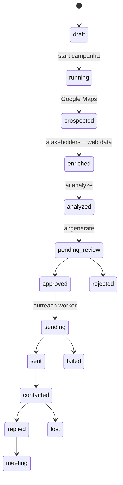
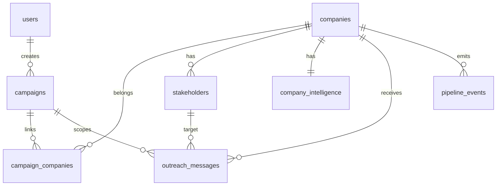

# Valiant Prospector

Sistema de prospeccao comercial B2B automatizado com enriquecimento em cascata, IA aplicada e outreach multicanal.

## O que e

O Valiant Prospector elimina o processo manual de pesquisa em planilhas e transforma prospeccao B2B em pipeline operacional: encontra empresas por nicho e cidade, enriquece decisores com providers plugaveis, gera inteligencia comercial com IA, produz mensagens personalizadas e executa envio com aprovacao humana.

## Arquitetura



### Componentes

- Frontend: dashboard operacional (campanhas, pipeline, aprovacoes e feed realtime).
- API: autenticacao JWT, endpoints de negocio e atualizacoes via WebSocket.
- Workers: pipeline assincromo com Asynq (prospeccao, enriquecimento, IA, outreach).
- PostgreSQL + pgvector: persistencia transacional e similaridade vetorial.
- Redis: broker das filas e controle de workers.
- Playwright service: scraping isolado em Node.js.
- Traefik (profile edge): reverse proxy e TLS automatico via Let's Encrypt.

## Funcionalidades

### Prospeccao

- Busca de empresas por nicho/cidade/radio via Google Maps Places.
- Persistencia com deduplicacao por `google_place_id`.
- Vinculo de empresas com campanhas.

### Enriquecimento

- Fallback de stakeholders via providers desacoplados (`apollo` -> `hunter`).
- Enriquecimento web com website e Reclame Aqui via Playwright.
- Consolidacao de inteligencia por empresa.

### IA

- Analise de fit, dores, stack e persona.
- Geracao de mensagens para WhatsApp e Email por contexto de campanha.
- Embeddings para apoio a deduplicacao semantica.

### Outreach

- Fluxo com aprovacao humana (`pending_review -> approved -> sending -> sent|failed`).
- Envio por Evolution API e SendGrid com circuit breaker.
- Idempotencia para reduzir reenvio em retries.

### Operacao

- Stack containerizada com Docker Compose.
- Healthchecks entre servicos.
- Monitoramento de filas com Asynqmon autenticado.

## Stack

| Camada | Tecnologia | Justificativa |
| --- | --- | --- |
| API | Go 1.22 + Fiber v2 | Baixa latencia e throughput alto |
| HTTP client Go | fasthttp | Padrao unico no backend e pooling eficiente |
| Fila | Asynq + Redis | Retries, deduplicacao e prioridades |
| Banco | PostgreSQL 16 + pgvector | ACID + busca vetorial |
| Frontend | Next.js 14 + TypeScript + Tailwind | UI moderna com tipagem |
| Scraping | Node.js + Playwright | Navegacao real e extracao robusta |
| Reverse Proxy | Traefik v3 | Roteamento e TLS automatico |

## Pre-requisitos

- Docker 24+
- Docker Compose v2+
- Make (opcional)
- Go 1.22+ (apenas para execucao local sem Docker)
- Node.js 20+ (apenas para execucao local de frontend/playwright)

## Configuracao

1. Copie `.env.example` para `.env`.
2. Preencha variaveis obrigatorias.
3. Suba o ambiente.

### Variaveis de ambiente principais

| Variavel | Obrigatoria | Impacto se vazio |
| --- | --- | --- |
| `DATABASE_URL` | Sim | API/worker nao inicializam |
| `JWT_SECRET` | Sim | API falha na inicializacao |
| `OPENAI_API_KEY` | Sim | Features de IA falham |
| `GOOGLE_MAPS_API_KEY` | Sim | Prospeccao falha |
| `SENDGRID_API_KEY` | Sim | Email falha |
| `EVOLUTION_API_KEY` | Sim | WhatsApp falha |
| `MINIO_ENDPOINT` | Sim | API/worker falham |
| `MINIO_ACCESS_KEY` | Sim | API/worker falham |
| `MINIO_SECRET_KEY` | Sim | API/worker falham |
| `CORS_ALLOWED_ORIGINS` | Sim | Frontend bloqueado por CORS |
| `TRAEFIK_ACME_EMAIL` | Sim no profile edge | Let's Encrypt nao emite certificado |
| `TRAEFIK_APP_HOST` | Sim no profile edge | Router frontend nao sobe |
| `TRAEFIK_API_HOST` | Sim no profile edge | Router API nao sobe |
| `APOLLO_API_KEY` | Nao | Provider Apollo desativado |
| `HUNTER_API_KEY` | Nao | Provider Hunter desativado |

## Como rodar

### Desenvolvimento local

```bash
make up
# ou
# docker compose up -d --scale worker=2
```

### Com Traefik (profile edge)

```bash
docker compose --profile edge up -d --scale worker=2
```

### Healthcheck

```bash
docker compose ps
curl http://localhost:3000/health
curl http://localhost:3002/health
```

### Migrations

```bash
make migrate
```

### Criar primeiro admin

Foi adicionado CLI de seed para evitar SQL manual:

```bash
ADMIN_NAME="Admin" \
ADMIN_EMAIL="admin@empresa.com" \
ADMIN_PASSWORD="SenhaForteAqui" \
make seed-admin
```

Implementacao: `backend/cmd/seedadmin/main.go`.

## Sistema de providers

A arquitetura de stakeholders esta desacoplada em contrato + registry.

### Contratos reais no codigo

- Interface: `StakeholderProvider` em `backend/internal/worker/stakeholder_provider.go`
- Registry/Fallback: `stakeholderProviderRegistry` em `backend/internal/worker/stakeholder_provider.go`
- Provider Apollo: `newApolloStakeholderProvider` em `backend/internal/worker/provider_apollo.go`
- Provider Hunter: `newHunterStakeholderProvider` em `backend/internal/worker/provider_hunter.go`
- Worker consumidor (sem dependencias concretas): `linkedInWorker` em `backend/internal/worker/linkedin_worker.go`

### Ordem de fallback atual

1. `apollo`
2. `hunter`

A ativacao e 100% por env var no bootstrap do registry:

- `APOLLO_API_KEY` habilita Apollo.
- `HUNTER_API_KEY` habilita Hunter.

### Como adicionar novo provider (passo a passo real)

1. Crie arquivo `backend/internal/worker/provider_<nome>.go`.
2. Implemente a interface `StakeholderProvider`:
- `Name() string`
- `Find(ctx context.Context, company db.Company) ([]StakeholderCandidate, error)`
3. Retorne `[]StakeholderCandidate` com `Source` preenchido.
4. Registre no `newStakeholderProviderRegistry` em `backend/internal/worker/stakeholder_provider.go` respeitando a ordem de fallback.
5. Adicione env var de ativacao no `docker-compose.yml` e `.env.example`.
6. Rode `go test ./...` no backend.

## Pipeline de prospeccao



## API

| Metodo | Rota | Auth | Descricao |
| --- | --- | --- | --- |
| POST | `/api/auth/login` | Nao | Login |
| POST | `/api/auth/refresh` | Nao | Refresh token |
| GET | `/api/companies` | Sim | Listagem paginada |
| PATCH | `/api/companies/:id/stage` | Sim | Atualiza estagio |
| GET | `/api/campaigns` | Sim | Lista campanhas |
| POST | `/api/campaigns` | Sim | Cria campanha |
| POST | `/api/campaigns/:id/start` | Sim | Inicia campanha |
| GET | `/api/outreach/pending-review` | Sim | Pendentes |
| POST | `/api/outreach/:id/approve` | Sim | Aprova e enfileira envio |
| GET | `/api/dashboard/stats` | Sim | KPIs |
| GET | `/ws` | Sim | Feed realtime |
| GET | `/health` | Nao | Healthcheck |

## Banco de dados



Uso de pgvector: `companies.embedding vector(1536)` e consultas por distancia coseno (`<=>`) para similaridade semantica.

## Deploy em producao (EC2 + Traefik + Let's Encrypt)

1. Provisione EC2 (Ubuntu 22.04) com SG liberando 80/443.
2. Aponte DNS:
- `app.seudominio.com` para a EC2
- `api.seudominio.com` para a EC2
3. Configure `.env` de producao com:
- `TRAEFIK_ACME_EMAIL`
- `TRAEFIK_APP_HOST=app.seudominio.com`
- `TRAEFIK_API_HOST=api.seudominio.com`
- secrets obrigatorios (`JWT_SECRET`, `ASYNQMON_PASSWORD`, etc).
4. Suba stack com edge profile:

```bash
docker compose --profile edge up -d --scale worker=2
```

5. Valide issuance de certificado:
- `docker compose logs -f traefik`
- busque eventos ACME sem erro.
6. Valide rotas HTTPS:
- `https://app.seudominio.com`
- `https://api.seudominio.com/health`
7. Execute smoke test funcional (login, start campanha, aprovacao e envio).

## Testes (obrigatorio antes de PR)

```bash
# backend
make test-backend

# frontend (se houver testes configurados)
make test-frontend

# lint (backend + frontend)
make lint
```

Checklist recomendado para PR:

1. `go test ./...` em `backend` sem falhas.
2. Build do frontend (`npm run build`) sem erro.
3. Fluxo minimo manual: login -> campanha -> start -> approve.

## Operacao diaria

```bash
# logs
docker compose logs -f api
docker compose logs -f worker
docker compose logs -f playwright-svc

# escalar workers
docker compose up -d --scale worker=4

# acessar banco
docker compose exec postgres psql -U $POSTGRES_USER valiant_prospector

# monitorar filas (basic auth)
# http://localhost:8082
```

## Troubleshooting

### WhatsApp desconectado

- Causa: instancia Evolution sem sessao ativa.
- Solucao: reconectar instancia e validar chave API.

### Task presa na DLQ

- Causa: payload invalido ou dependencia externa fora do ar.
- Solucao: corrigir causa raiz e reprocessar via Asynqmon.

### Certificado SSL nao emitido

- Causa: DNS errado, porta 80 fechada, ou ACME email invalido.
- Solucao: validar DNS, SG e logs do Traefik.

### Empresa duplicada

- Causa: insercoes paralelas e dados incompletos no enriquecimento.
- Solucao: revisar deduplicacao por `google_place_id` e embedding.

## Licenca

Uso interno Valiant Group.
